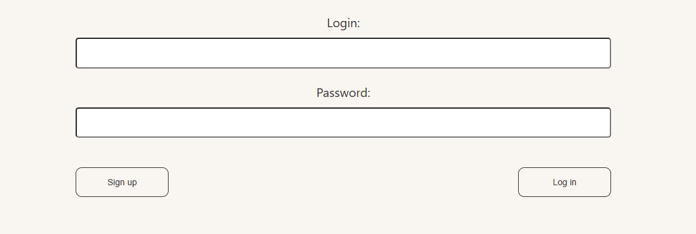
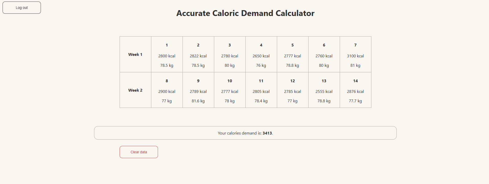
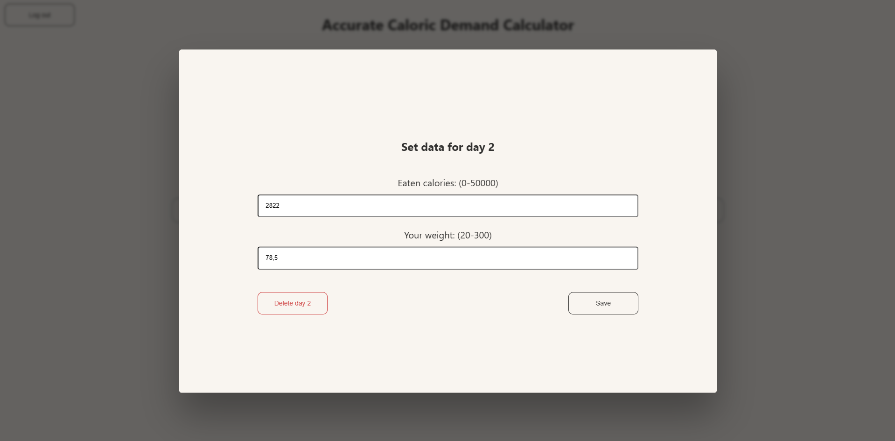

# Caloric Demand Calculator - Frontend

This is the frontend for the **Caloric Demand Calculator** application, built with [React.js](https://reactjs.org/). It provides a user-friendly interface for managing caloric data, performing calculations, and interacting with the backend APIs.

## Features

- **Login Form**: Authenticate users via the backend.
- **Caloric Data Management**: Add, update, and delete caloric data.
- **Dynamic Calculations**: Display calculated results based on user input.
- **Responsive Design**: Ensure compatibility across different devices.

### Key Components

- **CaloriesTable**: Displays a table of caloric data entries.
- **CaloriesResult**: Displays calculated caloric results dynamically.
- **LoginBox**: Manages user login functionality.
- **ClearDataBtn**: Button for clearing all stored data.
- **UpdateDataPopup**: Popup for editing caloric data entries.

## Demo Screenshots

Below are some screenshots showcasing the application's features:

### 1. Login Page


### 2. Dashboard


### 3. Data Entering Form



## Getting Started

### Requirements

- Node.js (v16 or later)

### Suggested folder structure (to types work correctly):

* <b>/caloric-demand-front</b> for <a href="https://github.com/Dzejkop02/caloric-demand-front" target="_blank">frontend</a>
* <b>/caloric-demand-back</b> for <a href="https://github.com/Dzejkop02/caloric-demand-back" target="_blank">backend</a>

### Installation

1. Clone the repository:
   ```bash
   git clone https://github.com/Dzejkop02/caloric-demand-front
   cd caloric-demand-front
   ```

2. Install dependencies:
    ```bash
   npm install
   ```
   
3. Running the Application:
    ```bash
   npm start
   ```
